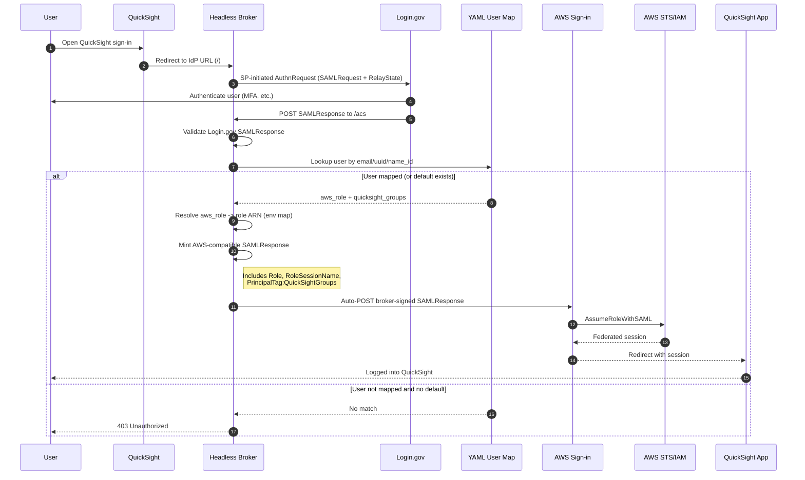

# Headless Login.gov Broker (Barebones)

This repository now includes a minimal headless broker mode that can sit between
an SP initiation source and Login.gov.

## Authentication Flow



### Linear Flow View

```mermaid
flowchart LR
   A[User opens QuickSight sign-in] --> B[QuickSight redirects to Broker IdP URL]
   B --> C[Broker sends SAML AuthnRequest to Login.gov]
   C --> D[User authenticates at Login.gov]
   D --> E[Login.gov POSTs SAMLResponse to Broker /acs]
   E --> F[Broker validates Login.gov assertion]
   F --> G[Broker looks up user in YAML map]
   G --> H{Mapped user or default?}
   H -->|No| I[Return 403 Unauthorized]
   H -->|Yes| J[Resolve aws_role to role ARN from env map]
   J --> K[Mint AWS-compatible SAMLResponse]
   K --> L[Include Role, RoleSessionName, PrincipalTag QuickSightGroups]
   L --> M[Auto-POST response to AWS sign-in]
   M --> N[AWS STS AssumeRoleWithSAML]
   N --> O[AWS federated session created]
   O --> P[Redirect to QuickSight app]
   P --> Q[User lands in QuickSight]
```



## What It Does

- `GET /`
   - Headless entrypoint. Immediately starts SP-initiated SAML with Login.gov.
- `GET /idp-init`
   - Alias for login start.
  - Preserves incoming relay state (`RelayState`, `relay_state`, or `TargetResource`) in a signed broker token.
- `POST /acs`
  - Receives Login.gov SAML response.
  - Validates assertion via `ruby-saml`.
   - In `aws_broker_assertion` mode (default), mints a broker-signed AWS-compatible SAML response including Role and RoleSessionName, then auto-posts to `https://signin.aws.amazon.com/saml`.
   - In `aws_post` mode, forwards the Login.gov assertion as-is.
   - In `inspect` mode, returns JSON with NameID and attributes.
- `GET /health`
  - Health probe.

## Important Limitations

- This is intentionally barebones.
- It supports minting an AWS-compatible assertion, but role mapping is intentionally minimal (single configured role).
- You must configure AWS IAM to trust this broker as a SAML provider.

## Cloud.gov Fit

- Configure QuickSight IdP URL to your broker root URL, for example:
   - `https://<your-app>.app.cloud.gov/`
- Broker metadata endpoint for AWS IAM SAML provider:
   - `https://<your-app>.app.cloud.gov/metadata`
- The broker immediately redirects to Login.gov.
- After Login.gov posts back to `/acs`, broker auto-posts to AWS sign-in.
- Set `BROKER_DEFAULT_RELAY_STATE` if you want a deterministic QuickSight destination.

## AWS Requirements

- Create an IAM SAML provider in AWS using the broker certificate.
- Create an IAM role trusted by that SAML provider for `sts:AssumeRoleWithSAML`.
- Configure broker env:
   - `BROKER_AWS_ROLE_ARN` (default/fallback role ARN)
   - `BROKER_AWS_ROLE_ARNS_JSON` (optional role key -> role ARN map)
   - `BROKER_AWS_SAML_PROVIDER_ARN`
   - `BROKER_AWS_IDP_ENTITY_ID`
- Default minted attributes:
   - `https://aws.amazon.com/SAML/Attributes/Role`
   - `https://aws.amazon.com/SAML/Attributes/RoleSessionName`

## YAML User Map Authorization

- Configure `BROKER_USER_MAP_FILE` to a YAML file, for example [config/user_map.yml](config/user_map.yml).
- Default lookup order is `email,uuid,name_id` (override with `BROKER_USER_MAP_KEYS`).
- If map file is configured and a user is not found, broker returns `403` unless `default` mapping exists.

Example shape:

```yaml
users:
   user.one@example.gov:
      aws_role: reader
      role_session_name: user-one
      session_duration: 3600
      quicksight_groups:
         - reader-group
         - team-data

default:
   aws_role: reader
   quicksight_groups:
      - default-reader
```

Role ARN resolution:

- Broker reads `aws_role` from user map and resolves it via `BROKER_AWS_ROLE_ARNS_JSON`.
- If `aws_role` is missing/empty, broker falls back to `BROKER_AWS_ROLE_ARN`.
- `BROKER_AWS_SAML_PROVIDER_ARN` is always sourced from environment.

When `quicksight_groups` is present, broker emits these AWS attributes in the minted assertion:

- `https://aws.amazon.com/SAML/Attributes/PrincipalTag:QuickSightGroups`
- `https://aws.amazon.com/SAML/Attributes/TransitiveTagKeys` (value: `QuickSightGroups`)

## Cloud.gov Deploy

1. Copy and edit [manifest.broker.yml](manifest.broker.yml):
   - Set `name`
   - Set `BROKER_ASSERTION_CONSUMER_SERVICE_URL` to your app URL `/acs`
   - Set `BROKER_IDP_CERT_FINGERPRINT`
   - Set strong `BROKER_STATE_SECRET`
2. Deploy:

   ```bash
   cf push -f manifest.broker.yml
   ```

3. Set QuickSight IdP URL to your broker root URL:
   - `https://<your-app>.app.cloud.gov/`

## Quick Start

1. Create env file:

   ```bash
   cp .env.broker.example .env
   ```

2. Fill required values in `.env`:
   - `BROKER_ASSERTION_CONSUMER_SERVICE_URL`
   - `BROKER_ISSUER`
   - `BROKER_IDP_SSO_TARGET_URL`
   - `BROKER_IDP_CERT_FINGERPRINT`
   - `BROKER_STATE_SECRET`
   - `BROKER_AWS_ROLE_ARN`
   - `BROKER_AWS_SAML_PROVIDER_ARN`
   - `BROKER_AWS_IDP_ENTITY_ID`
   - Optional: `BROKER_USER_MAP_FILE`
   - Optional: `BROKER_USER_MAP_KEYS`
   - Optional: `BROKER_DEFAULT_RELAY_STATE`
   - Optional: `BROKER_RELAY_STATE_ALLOWLIST_PREFIXES`

3. Run:

   ```bash
   bundle exec rackup -p 4567
   ```

4. Start login:

   ```bash
   open "http://localhost:4567/?RelayState=https%3A%2F%2Fexample.com%2Fpost-auth"
   ```

## Selecting App Mode

- `APP_MODE=rp` (default): original sample relying party app.
- `APP_MODE=broker`: headless broker app.

## Output Modes

- `aws_broker_assertion` (default): broker mints signed AWS-compatible response.
- `aws_post`: broker forwards Login.gov SAMLResponse without transformation.
- `inspect`: broker returns JSON for debugging.
